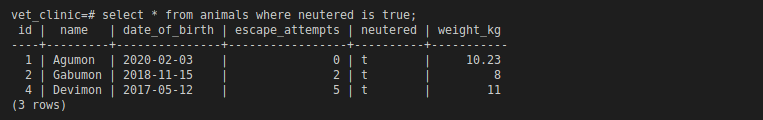
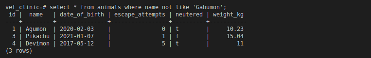
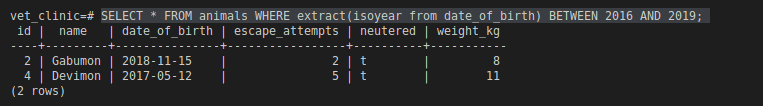
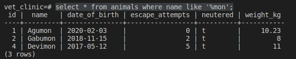
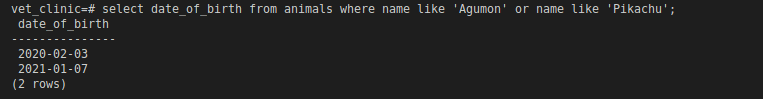
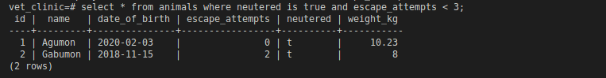
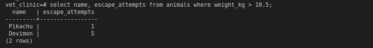
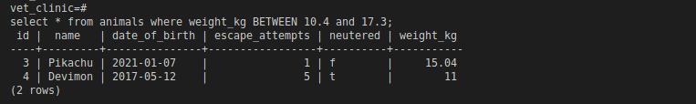

# Vet Clinic

> It's a database which help to store the information about a Vet clinic to get all information collected daily within an clinic where by we track the animals, owner. The owner can book for a visit with one of the clinic employee. Build with PostgresSQL.

# ScreenShot

## Getting Started

This repository includes files with plain SQL that can be used to recreate a database:

- Use [schema.sql](./schema.sql) to create all tables.
- Use [data.sql](./data.sql) to populate tables with sample data.
- Check [queries.sql](./queries.sql) for examples of queries that can be run on a newly created database. **Important note: this file might include queries that make changes in the database (e.g., remove records). Use them responsibly!**

## Authors

👤 **Josh Batey**

- GitHub: [@Bateyjosue](https://github.com/Bateyjosue)
- Twitter: [@JosueBatey](https://twitter.com/josuebatey)
- LinkedIn: [Josue (Josh) Batey](https://www.linkedin.com/in/josue-ishara/)

## 🤝 Contributing

Contributions, issues, and feature requests are welcome!

Feel free to check the [issues page](../../issues/).

## Show your support

Give a ⭐️ if you like this project!

## Acknowledgments

- Hat tip to anyone whose code was used
- Inspiration
- etc

## 📝 License

This project is [MIT](./MIT.md) licensed.
